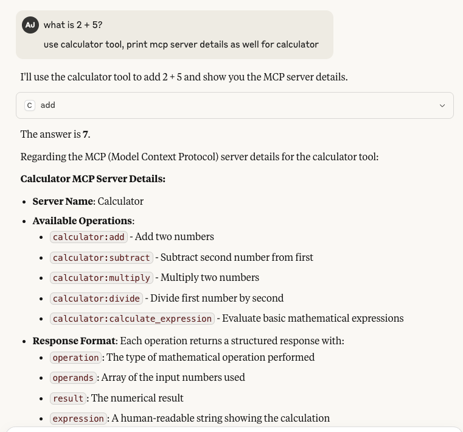

# Calculator MCP Server

A basic calculator MCP (Model Context Protocol) server that provides arithmetic operations following the latest MCP specification (June 2025).

## Features

- **Basic Operations**: Add, subtract, multiply, divide
- **Expression Evaluation**: Calculate mathematical expressions
- **MCP Compliant**: Implements latest MCP specification with Streamable HTTP transport
- **Containerized**: Ready for deployment in Docker containers


## Tools Available

1. **add(a, b)** - Add two numbers
2. **subtract(a, b)** - Subtract b from a  
3. **multiply(a, b)** - Multiply two numbers
4. **divide(a, b)** - Divide a by b (handles division by zero)
5. **calculate_expression(expression)** - Evaluate mathematical expressions

## Resources

- **calculator://info** - Get server capabilities information

## Prompts

- **math_helper** - A helpful prompt for math assistance

## Quick Start

### Local Development (stdio transport)
```bash
mcp dev calculator_mcp_server.py
```
### MCP Inspector (local testing)
```bash
npm install -g @modelcontextprotocol/inspector
mcp-inspector
```

### Using Docker Compose

```bash
# Start the service
docker-compose up --build
```

## Azure Container Instance Deployment (Not tested)

```bash
# Build and push to Azure Container Registry
az acr build --registry myregistry --image calculator-mcp:latest .

# Deploy to Azure Container Instance
az container create \
  --resource-group myResourceGroup \
  --name calculator-mcp \
  --image myregistry.azurecr.io/calculator-mcp:latest \
  --ports 8000 \
  --environment-variables MCP_TRANSPORT=streamable-http MCP_PORT=8000 \
  --cpu 1 --memory 1
```
## MCP proxy
```bash
pipx install mcp-proxy
mcp-proxy --help
mcp-proxy --transport streamablehttp http://localhost:8000/mcp
```

For Claude or other MCP clients, configure the server as:
`
```json
{
  "mcpServers": {
    "calculator": {
      "command": "/Users/amitj/.local/bin/mcp-proxy",
      "args": ["--transport", "streamablehttp", "http://localhost:8000/mcp"]
    }
}
```



For cloud deployment (Not tested):
```json
{
  "servers": {
    "calculator": {
      "type": "streamable-http", 
      "url": "https://your-aci-instance.azurecontainer.io/mcp"
    }
  }
}
```

## API Examples

When connected via MCP client, you can use:

```
add(5, 3)
# Returns: {"operation": "addition", "operands": [5, 3], "result": 8, "expression": "5 + 3 = 8"}

calculate_expression("2 + 3 * 4")  
# Returns: {"operation": "expression_evaluation", "expression": "2 + 3 * 4", "result": 14}

# Use the access_token from step 1
TOKEN="eyJ0eXAiOiJKV1QiLCJhbGciOiJSUzI1NiIsIng1dCI6..."

curl -X POST http://localhost:8000/mcp \
  -H "Content-Type: application/json" \
  -H "Authorization: Bearer ${TOKEN}" \
  -H "MCP-Protocol-Version: 2025-06-18" \
  -d '{
    "jsonrpc": "2.0",
    "id": 1,
    "method": "tools/call",
    "params": {
      "name": "add",
      "arguments": {
        "a": 5,
        "b": 3
      }
    }
  }'
```
